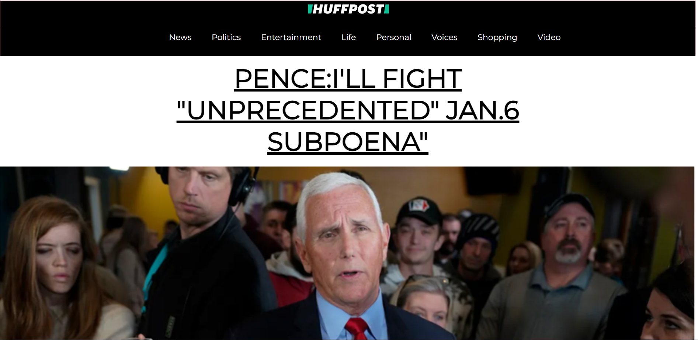

# Huffpost
Huffpost site

#### This is my mockup site for the Huffpost news site

## How it's Made:
Tech used: HTML, CSS

I used basic HTML to structure the sites using floats & css for styling

## Optimizations
I'd like to go back and redo the site using flexbox to improve my skills within CSS

## Lessons Learned
I learned an important lesson on structuring sites & alot of the history of how sites used to be made

## Example
Take a look at the example that i have below:

